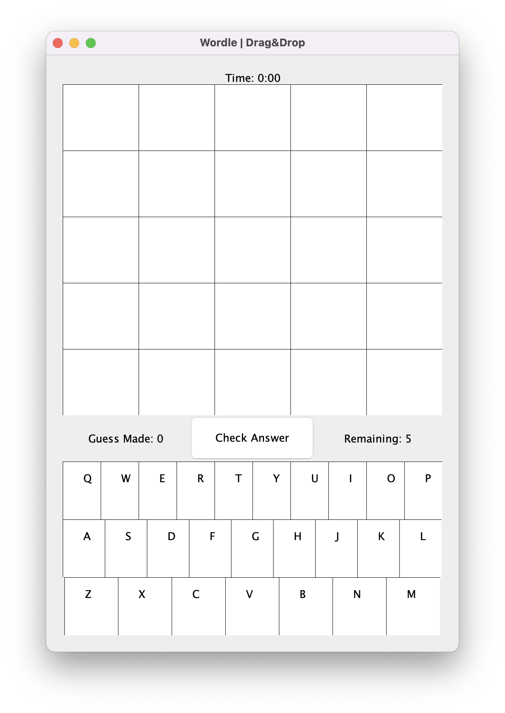
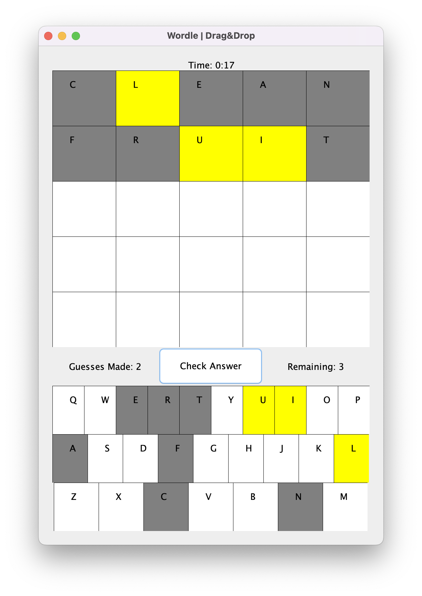

# Wordle

Click [here](https://www.nytimes.com/games/wordle/index.html) for the original Wordle game.

---

## About Wordle

Wordle is an internet-based word game which gives six attempts to the players to guess a five-letter word. Wordle gives feedback to the player after each guess. This feedback is done by coloring the letters of the guess word.

- **Gray:** Letter is not present
- **Yellow:** Letter is present but misplaced
- **Green:** Letter is present and in the right place

---

# Getting Started

The developed project has 3 game modes. These are drag&drop, keyboard and multiplayer modes. The player enters their name after choosing the game mode they want to play. Name is used to record high scores. Unlike the original game, in this game the player is given 5 guesses instead of 6. The time to find the answer is counted with the help of a timer and displayed on the screen.

	

# Game Modes

- ## Drag & Drop Mode

Drag&drop mode provides a virtual keyboard on the bottom of the screen. Player can drag the desired letter to the trial panel with a mouse move. After all 5 cells are filled, player clicks the button to check their answer. The program paints the letters on the trial panel -and on the keyboard as well- in the appropriate colors.

	

	

	

- ## Keyboard Mode

Player uses computer keyboard to type their guess. Compared to the drag&drop, this game mode has a disadvantage. Because the letters on the keyboard cannot be painted in keyboard mode. The player may have to check the letters before each guess.

	

	

- ## Multiplayer Mode

In the multiplayer game mode, each player is given 3 guesses. This mode has the same look as the keyboard mode.

	

	

---

## Highest Scores

The highest score of each game mode is saved in a text file which is located in resources folder. There is a custom comparable HighScore.java class in this project. For two scores to be compared, they must be played in the same game mode. Guess counts are checked first. If they are equal, the time to find the answer is checked.

	

---

## External Sources

- To create a drag&drop keyboard and guess panel, the demo example by IITK (Indian Institute of Technology Kanpur) at [this](http://www.iitk.ac.in/esc101/05Aug/tutorial/uiswing/misc/example-1dot4/index.html#DragPictureDemo) link was used. Some modifications has been made on the handler. The reason for these changes is that drag&drop operations must be one-sided. Player should be able to drag letters from the keyboard to the trial panel, but not vice versa.

---

## Code Descriptions

Comment lines are available in Turkish -for now. English will be added as soon as possible.